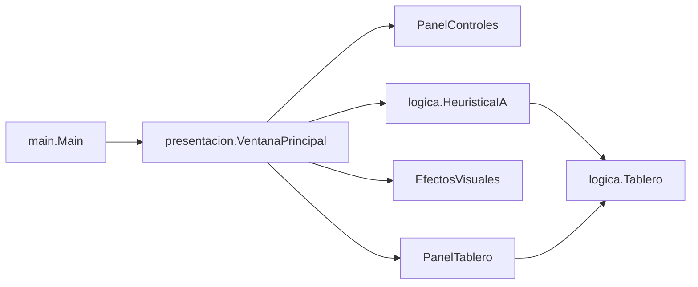

<div align="center">
  
  <h1>ReinasSolver</h1>
  <p><b>Resuelve el problema de las N reinas (N de 1 a 100) con Backtracking y Min-Conflicts en una interfaz Java Swing.</b></p>
  
  
  
  
  <p>
    <a href="#-inicio-rápido">Inicio rápido</a> ·
    <a href="#-características">Características</a> ·
    <a href="#️-arquitectura">Arquitectura</a> ·
    <a href="#-pruebas">Pruebas</a> ·
    <a href="#-lo-que-todavía-no-existe">Limitaciones</a>
  </p>
</div>

ReinasSolver permite ver en el mismo problema la diferencia entre **búsqueda exhaustiva** (Backtracking, para tableros pequeños) y **búsqueda heurística** (Min-Conflicts con reinicios, para tableros grandes). Es una herramienta didáctica de escritorio: no compara benchmarks ni resuelve otras variantes del problema.

## 🎬 Vista rápida

No hay capturas: no se logró una captura fiable de la ventana. Flujo real de uso:

```text
Elegir N (control numérico, 1-100)
        │
        ▼
   [Resolver]  ── N ≤ 8 ──► Backtracking  ┐
        │                                  ├─► tablero + estadísticas (reinas, conflictos, validez)
        └───── N > 8 ──► Min-Conflicts ────┘
   [Reiniciar] limpia el tablero · F1 abre la ayuda · Ctrl+R / Ctrl+N / Ctrl+Q
```

## ✨ Características

| Característica | Detalle |
|---|---|
| Backtracking (N ≤ 8) | Una reina por columna, comprobando fila y diagonales con `Tablero.esSeguro()`; informa que N=2 y N=3 no tienen solución |
| Min-Conflicts (N > 8) | Parte de una colocación aleatoria y mueve reinas en conflicto a la fila con menos conflictos; hasta 30 reinicios de 1000 intentos cada uno |
| Selector de tamaño | `JSpinner` de 1 a 100 (por defecto 8) |
| Estadísticas | Reinas colocadas, conflictos totales y validez de la solución |
| UI sin bloqueos | La resolución corre en un `SwingWorker` |
| Efectos visuales y atajos | Animaciones, mensajes de éxito/error y atajos Ctrl+R, Ctrl+N, Ctrl+Q y F1 |

## 🏗️ Arquitectura



<details>
<summary>Estructura de carpetas</summary>

```text
src/logica/         Tablero, HeuristicaIA
src/presentacion/   VentanaPrincipal, PanelControles, PanelTablero, EfectosVisuales
src/main/           Main
test/logica/        TableroTest, HeuristicaIATest (JUnit 5)
pom.xml             Maven (release 17)
nbproject/, .project, .classpath   metadatos de NetBeans y Eclipse
```

</details>

## 🚀 Inicio rápido

| Requisito | Versión |
|---|---|
| JDK | 17 o superior |
| Maven | Opcional (recomendado) |

```bash
# Con Maven: compila, prueba y empaqueta
mvn package
java -jar target/reinassolver-1.0.0.jar

# Sin Maven
javac -d bin src/logica/*.java src/main/*.java src/presentacion/*.java
java -cp bin main.Main
```

Usa el control de tamaño, pulsa **Resolver** y luego **Reiniciar** para empezar de nuevo.

## 🧪 Pruebas

```bash
mvn test
```

Resultado verificado: **64 pruebas, todas OK** (52 en `HeuristicaIATest` y 12 en `TableroTest`, JUnit 5.10.2). Cubren `Tablero` (colocar/quitar, `esSeguro`, conflictos, validez) y `HeuristicaIA` de extremo a extremo, revalidando cada solución de forma independiente: N=1, N=2 y N=3 sin solución, Backtracking de N=4 a 8 y Min-Conflicts para N=40 y N=100 bajo `@Timeout`. La CI (`.github/workflows/ci.yml`) ejecuta `mvn test` y `mvn package` con JDK 17. No hay pruebas de la interfaz Swing.

## 🚧 Lo que todavía no existe

- Sin captura ni demostración grabada en este repositorio.
- Sin pruebas automatizadas de la interfaz gráfica.
- Min-Conflicts no garantiza convergencia: si agota los 30 reinicios informa que no encontró solución.
- No se pueden colocar reinas a mano ni elegir el algoritmo: el umbral N ≤ 8 está fijo en `HeuristicaIA.resolver()`.

## 📄 Licencia

MIT, ver [LICENSE](LICENSE).

<div align="center"><sub>Hecho por Luiss2080 · N reinas en Java Swing</sub></div>
